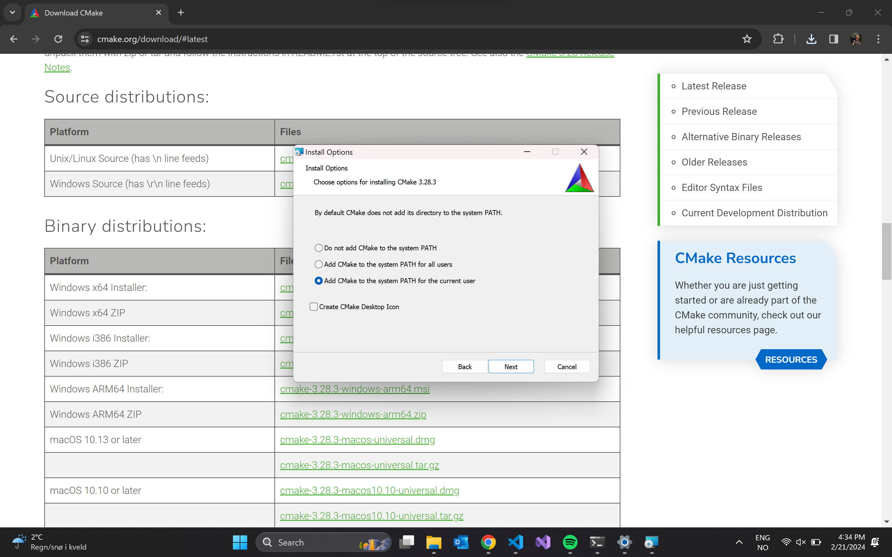

# NotRocketScience - Flight Computer
[Azure RTOS docs](https://github.com/eclipse-threadx/rtos-docs/tree/main)

This repository based of Matej Blagšič's [repository](https://github.com/prtzl/stm32-cmake/tree/master) for cmake with stm32.

## Clone
```shell
git clone --recurse-submodules -j8 git@github.com:USN-Horizon/NRS-Flight-Computer-Verification.git
```
> **_NOTE:_** Recurse submodules makes sure to include the contents of [HAM](https://github.com/USN-Horizon/HAM).

## Dependencies
### Windows
#### Required
- Git `winget install git.git`
- [STM32 CubeCLT](https://www.st.com/en/development-tools/stm32cubeclt.html)
    - after STM32 CubeCLT is installed, we have to add enviroment paths, follow the guide in the link under:
    - https://helpdeskgeek.com/windows-10/add-windows-path-environment-variable/
    - examples of file paths: (check before if the paths already exist in the enviroment)
        - C:\ST\STM32CubeCLT\STM32CubeProgrammer\bin
        - C:\ST\STM32CubeCLT\GNU-tools-for-STM32\bin
        - C:\Program Files (x86)\GnuWin32\bin
- [cmake](https://cmake.org/download/) 
    - under Binary distributions: choose "Windows x64 installer" and choose "Add CMake to the system PATH for the current user".   

- pyocd `pip install pyocd`
    - if pip is not installed `python -m ensurepip`
#### Optional
- [MINGW](https://sourceforge.net/projects/mingw/files/latest/download)
    - MINGW should not be necessary if Qt is installed
- [STM32 CubeMX](https://www.st.com/en/development-tools/stm32cubemx.html)


# Guide

Building binary
```shell
make build
```
Flashing device
```shell
make flash
```
Removing build files
```shell
make clean
```
Generate documentation
```shell
make doc
```
Formatting
TODO

# Useful resources
- [STM32 CubeProgrammer](https://www.st.com/resource/en/user_manual/um2237-stm32cubeprogrammer-software-description-stmicroelectronics.pdf)

